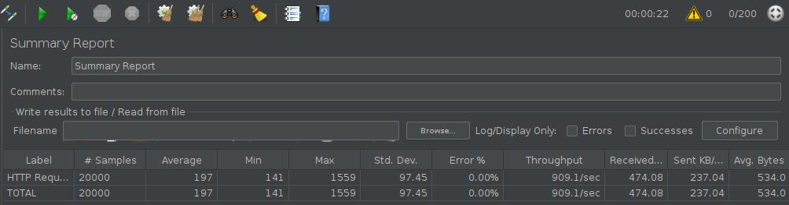

# batida-ponto-serverless
Aplicação conceitual de batida de ponto serverless usando uma arquitetura "The Storage First Pattern"

## Problema fictício

Um sistema de batida de ponto geralmente vai receber uma carga alta de requisições em horários muito próximos.

Isso gera uma sobrecarga grande em pequenas faixas de minutos e, depois disto, fica com pouca utilização.

A utilização de uma solução serverless para esse cenário tem 2 (dois) principais benefícios:
* Auto scaling out of the box: não precisa se preocupar com o dimensionamento da carga que vai receber
* Redução de custos: fora das faixas de horário que estão os picos de utilização, o sistema fica praticamente ocioso

## Arquitetura

O desenho da arquitetura está bem simples e não considera de fato todos os requisitos funcionais de um sistema de batida de ponto. A ideia é apenas ilustrar de forma macro o funcionamento.

Como a batida de ponto é realizada pelo funcionário e muitas vezes isso ocorre inclusive off line, podemos utilizar uma arquitetura com o padrão "The Storage First", padrão este que [foi documentado pelo Jeremy Daly](https://www.jeremydaly.com/the-storage-first-pattern/).

Inclui como um requisito fictício a necessidade de escrever em um banco de dados relacional para efeitos de relatórios.


Podemos descrever as etapas como:
1. O client faz a requisição HTTPS para o API Gateway
2. API Gateway inclui a mensagem diretamente em uma fila, nesse caso utilizando SQS (Simple Queue Service)
3. Uma função Lambda faz a leitura das mensagens da fila e processa, incluindo esses dados em um banco de dados PostgreSQL
    * A função Lambda possui um throttle para não estourar o limite de conexões do banco de dados relacional
    * Nesse caso, estamos ainda utilizando um RDS Aurora Serverless

Também vemos a utilização de uma DLQ (dead queue letter) para armanezar as mensagens que deram erro no processamento assíncrono.
    
### Uso de DLQ na função Lambda

A escolha pelo uso de DLQ na função Lambda ao invés de direto no SQS foi uma escolha enviesada aqui do autor. Na prática, o efeito é o mesmo.

O legal de utilizar na função Lambda é que ele vai usar a DLQ para outros processos assíncronos também, como um evento vindo do S3, por exemplo.

Nesse código de exemplo, como a solução utiliza apenas SQS talvez até ficasse mais interessante, para efeitos de leitura, se a DLQ estivesse direto no SQS.

**Que tal exercitar isso em um fork desse projeto?**    
    
## Configuração

Você vai precisar fazer os seguintes ajustes para rodar isso no seu ambiente AWS:

1. Criar um arquivo chamado `rds_config.py` na raiz do projeto com o seguinte conteúdo:
```python
db_host = 'rds endpoint'
db_username = 'username'
db_password = 'password'
db_name = 'database name'
```
2. Alterar os nomes de VPC, Subnet e Security Group para ficaram iguais aos desse exemplo, OU trocar para os nomes que estão no seu ambiente AWS:

Essas configurações estão no arquivo `serverelss.yml`.
```yaml
  vpc:
    vpcName: 'vpc-default'
    subnetNames:
      - 'vpc-default_subnet-1'
    securityGroupNames:
      - 'default'
```

## Deploy

Feitos os ajustes basta executar o comando de deployment do Serverless Framework:
```bash
sls deploy
```

## Teste de carga

Para provar que essa arquitetura suporta o pico de batidas de ponto, fiz um teste de carga simples utilizando JMeter.
Além disso, não fiz nenhum ajuste de limites na AWS, está como uma conta default.



Na imagem podemos ver que em 22 segundos foram executadas 20.000 batidas de ponto, atingindo um througput de mais de 900 requisições por segundo.
Isso seria suficiente para suportar as batidas de ponto de uma empresa bastante grande :)